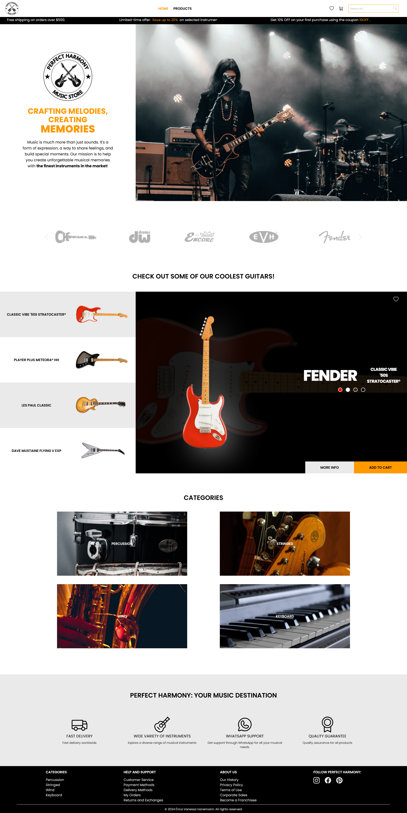

# Perfect Harmony Music Store

Perfect Harmony is a musical instrument ecommerce that offers a wide range of products, from guitars and keyboards to drums and recording equipment. The application features its own API that allows users to easily browse products by category, find detailed information about each instrument, add products to the cart, and even create a personalized wishlist. You can check out the layout design below:

- Home page

## Technologies

Technologies and libraries used so far:

- HTML e CSS (Tailwind CSS)
- JavaScript
- Vite
- React
- NPM
  - cors
  - express
  - nodemon
  - axios
  - react icons
  - react router
