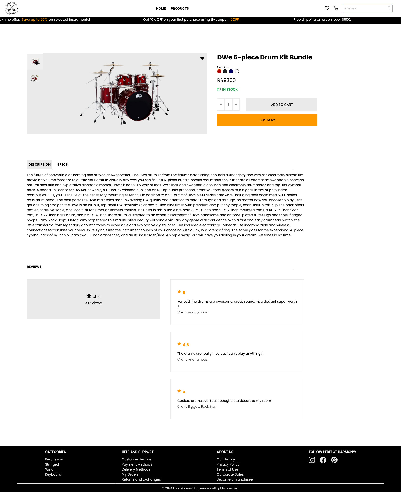
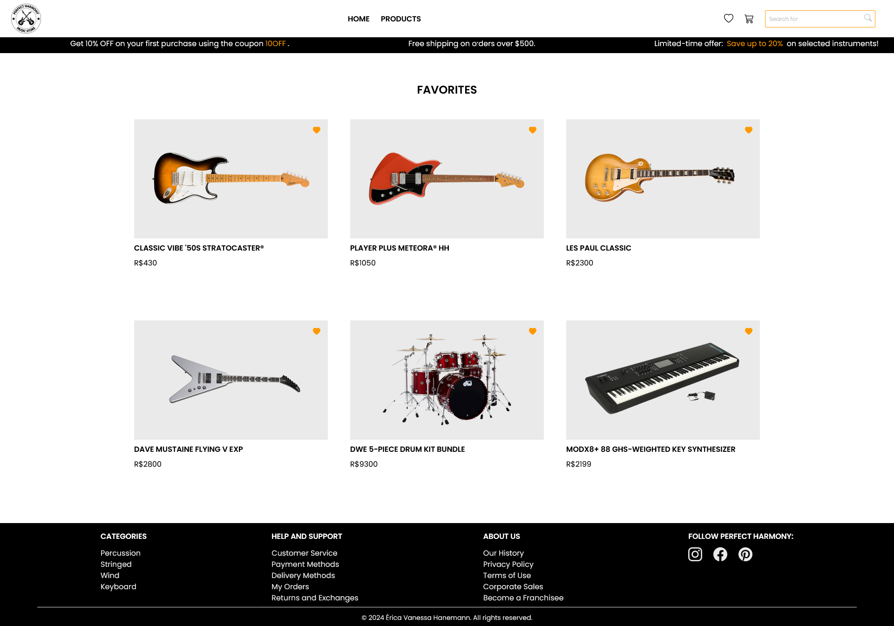

# Perfect Harmony Music Store

  Perfect Harmony is a musical instrument ecommerce that offers a wide range of products, from guitars and keyboards to drums and recording equipment. The application features its own API that allows users to easily browse products by category, find detailed information about each instrument, add products to the cart, and even create a personalized wishlist. 

  <a href="#layout">Layout</a>&nbsp;&nbsp;&nbsp;|&nbsp;&nbsp;&nbsp;
  <a href="#technologies">Technologies</a>

## Layout

- Home page
  

- Cart
  

- Products page
  

- Specific project page
  

- Favorites page
  

## Technologies

Technologies and libraries used:

- HTML e CSS (Tailwind CSS)
- JavaScript
- Vite
- React
- NPM
  - cors
  - express
  - nodemon
  - axios
  - react icons
  - react router
  - mongoose
- MongoDB Atlas
